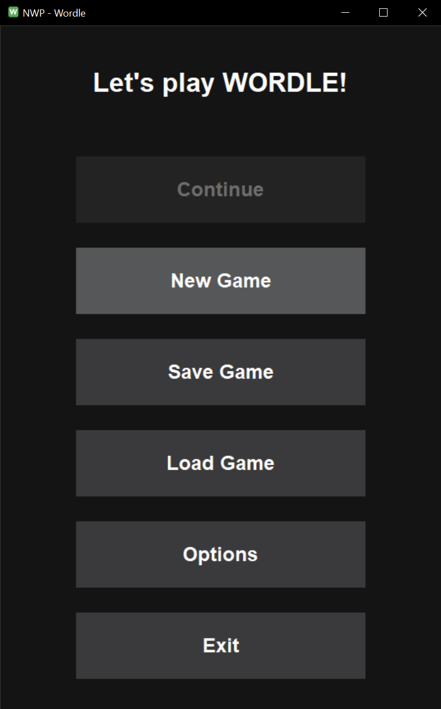
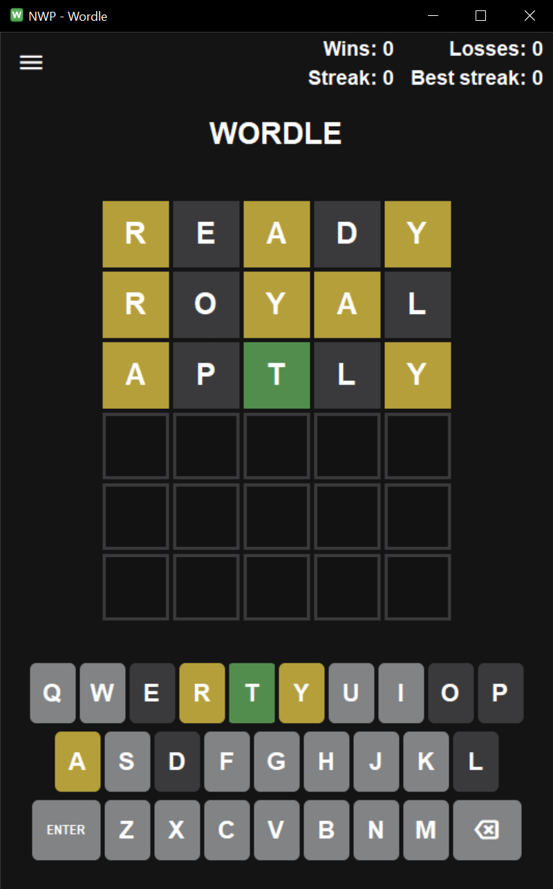

# 🎮 NWP-Wordle

A desktop implementation of the popular **Wordle** word-guessing game built with **wxWidgets** and **C++**.


## 📖 About

This project was made for a college assignment in Advanced Windows Programming.

## ✨ Features

- 🎯 **Classic Wordle Gameplay** - Guess the 5-letter word in 6 attempts
- 🎨 **Visual Feedback** - Color-coded tiles show correct letters, positions, and invalid guesses
- ⌨️ **Dual Input Methods** - Use on-screen keyboard or physical keyboard
- 📊 **Game Statistics** - Track wins, losses, current streak, and best streak
- 💾 **Save/Load Progress** - Resume your game anytime
- 🔤 **Keyboard Shortcuts** - Enter to submit, Backspace to delete, Escape for menu
- 🌙 **Dark Theme** - Comfortable gaming experience

## 📸 Screenshots

<table border="0" cellpadding="10" cellspacing="0" style="border: none;">
  <tr>
    <th align="center" style="border: none;">🏠 Main Menu</th>
    <th align="center" style="border: none;">🎮 Gameplay</th>
  </tr>
  <tr>
    <td align="center" style="border: none;">
      
    </td>
    <td align="center" style="border: none;">
      
    </td>
  </tr>
</table>

## 🎮 How to Play

1. **Start the game** and you'll see a 6x5 grid
2. **Type a 5-letter word** using your keyboard or click the on-screen keys
3. **Press Enter** to submit your guess
4. **Read the feedback:**
   - 🟩 **Green** - Correct letter in the right position
   - 🟨 **Yellow** - Correct letter in the wrong position
   - ⬜ **Gray** - Letter not in the word
5. **Use the clues** to make your next guess
6. **Win** by guessing the word in 6 attempts or fewer!

## 🚀 Getting Started

### Prerequisites

- Windows operating system (cross-platform support in the future)
- No additional dependencies required for the executable

### Installation

1. **Download the latest release** from the [Releases](https://github.com/Dovlek/NWP-Wordle/releases) page
2. **Extract the files** to your desired location
3. **Run `NWP-Wordle.exe`** to start playing

## 🔧 Building from Source

### Prerequisites for Building

- **C++ Compiler** (GCC, Clang, or MSVC)
- **wxWidgets** library (3.0 or later)
- **CMake** (optional, depending on build system)

### Build Instructions

1. **Clone the repository:**
  ```
git clone https://github.com/Dovlek/NWP-Wordle.git cd NWP-Wordle
```
3. **Install wxWidgets** (if not already installed)
- Follow the [wxWidgets installation guide](https://docs.wxwidgets.org/3.2/overview_install.html) for your platform
3. **Compile the project!**

## 📝 License

This project is licensed under the MIT License - see the [LICENSE](LICENSE) file for details.

## 🙏 Acknowledgments

- Inspired by the original [Wordle](https://www.nytimes.com/games/wordle/index.html) by Josh Wardle
- Built with the [wxWidgets](https://www.wxwidgets.org/) cross-platform GUI library
- Word lists sourced from common English dictionaries
